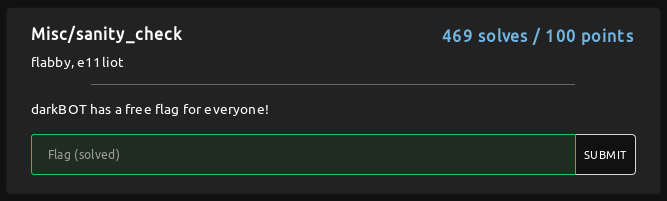
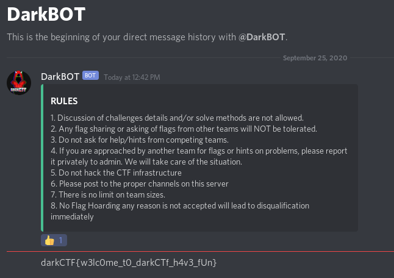
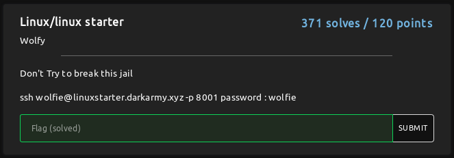
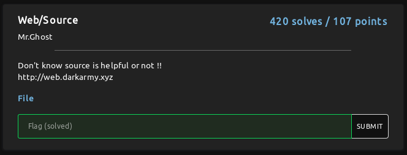
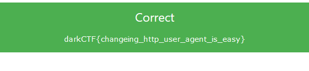
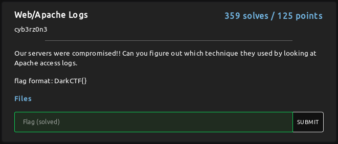
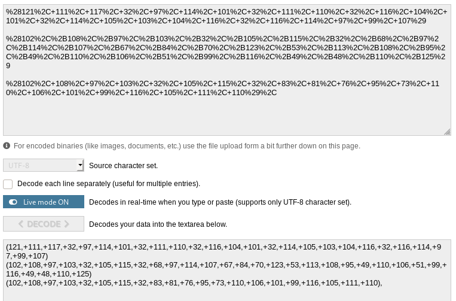
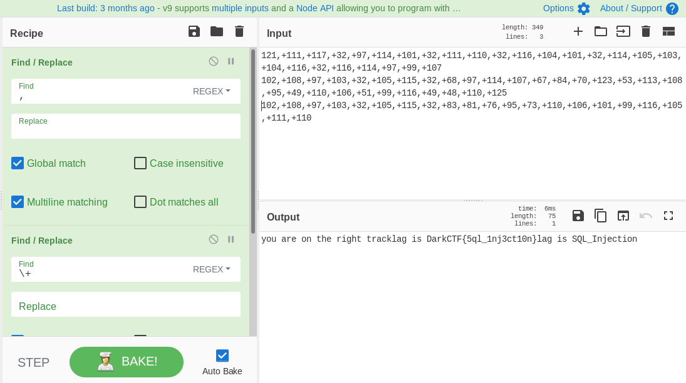

## Misc

### sanity_check


We got our first flag from Discord



**Flag: darkCTF{w3lc0me_t0_darkCTf_h4v3_fUn}**

## Linux
### linux starter


Okay lets fire up the terminal

```shell
root@*****:/home/z3n# ssh wolfie@linuxstarter.darkarmy.xyz -p 8001                                                  
The authenticity of host '[linuxstarter.darkarmy.xyz]:8001 ([52.66.238.72]:8001)' can't be established.                 
ECDSA key fingerprint is SHA256:c89dVKmOwWcuk3nhpaDFytMNR3U8Ph44wwIjTm8VECY.                                            
Are you sure you want to continue connecting (yes/no/[fingerprint])? yes                                                
Warning: Permanently added '[linuxstarter.darkarmy.xyz]:8001,[52.66.238.72]:8001' (ECDSA) to the list of known hosts.   
Password: wolfie
wolfie@9ad161dbc9ce:~$
wolfie@9ad161dbc9ce:~$ ls
bin  imp                                                                                                                
wolfie@9ad161dbc9ce:~$ cd imp/
wolfie@9ad161dbc9ce:~/imp$ ls
flag.txt                                                                                                                
wolfie@9ad161dbc9ce:~/imp$ cat flag.txt                                                                                 
darkCTF{h0pe_y0u_used_intended_w4y}                                                                                     
```
**Flag: darkCTF{h0pe_y0u_used_intended_w4y}**

## Web
### Source


They gave us a source File:
```php
<html>
    <head>
        <title>SOURCE</title>
        <style>
            #main {
    height: 100vh;
}
        </style>
    </head>
    <body><center>
<link rel="stylesheet" href="https://www.w3schools.com/w3css/4/w3.css">
<?php
$web = $_SERVER['HTTP_USER_AGENT'];
if (is_numeric($web)){
      if (strlen($web) < 4){
          if ($web > 10000){
                 echo ('<div class="w3-panel w3-green"><h3>Correct</h3>
  <p>darkCTF{}</p></div>');
          } else {
                 echo ('<div class="w3-panel w3-red"><h3>Wrong!</h3>
  <p>Ohhhhh!!! Very Close  </p></div>');
          }
      } else {
             echo ('<div class="w3-panel w3-red"><h3>Wrong!</h3>
  <p>Nice!!! Near But Far</p></div>');
      }
} else {
    echo ('<div class="w3-panel w3-red"><h3>Wrong!</h3>
  <p>Ahhhhh!!! Try Not Easy</p></div>');
}
?>
</center>
<!-- Source is helpful -->
    </body>
</html>
```
and for the flag we need to validate:
```php
$web = $_SERVER['HTTP_USER_AGENT'];
if (is_numeric($web)){
      if (strlen($web) < 4){
          if ($web > 10000){
                 echo ('<div class="w3-panel w3-green"><h3>Correct</h3>
  <p>darkCTF{}</p></div>');
```
from a google search I found out you can pass '9e9' as User-Agent, which is a numeric, has only length of 3, and its equal to 9000000000 which is obviously more than 10000.
I edited the user-agent to '9e9 'and sent a new request from my firefox and got the flag.



**Flag: darkCTF{changeing_http_user_agent_is_easy}**


### Apache Logs


From the logs we could see some SQLi payloads
after URL Decoding;


Then I used cyberchef to decode from decimal to ascii

Thanks @ysf for the recipe

**Flag: DarkCTF{5ql_1nj3ct10n}**


### Simple_SQL

### So_Simple


## Forensics
### Wolfie's Contact


ToDo: add Official and Community Writeup links
